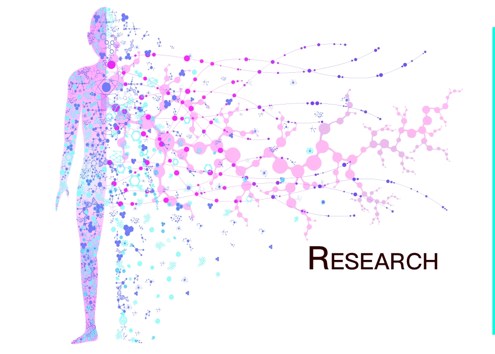
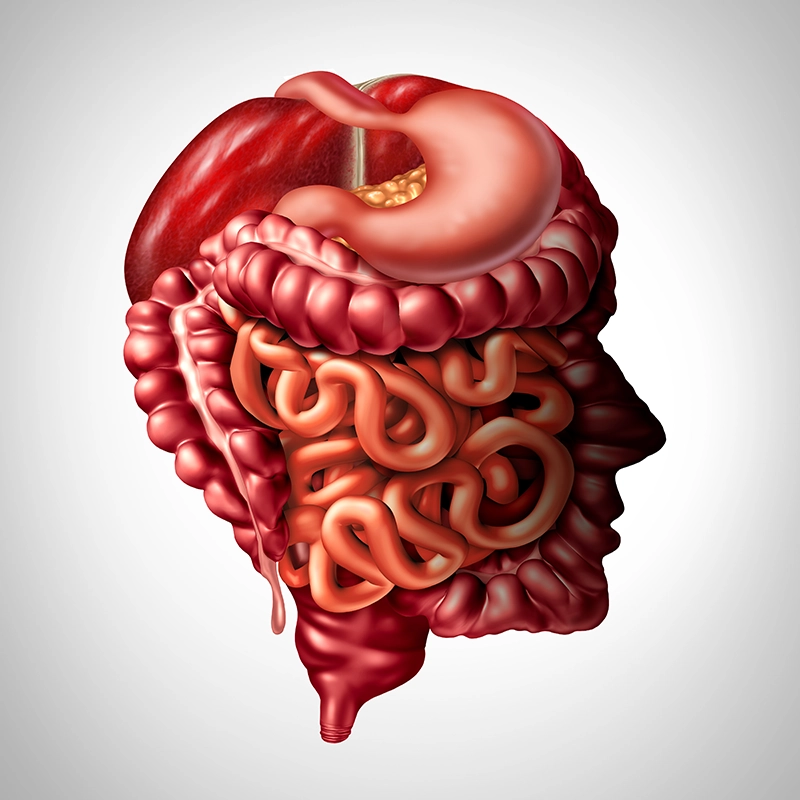
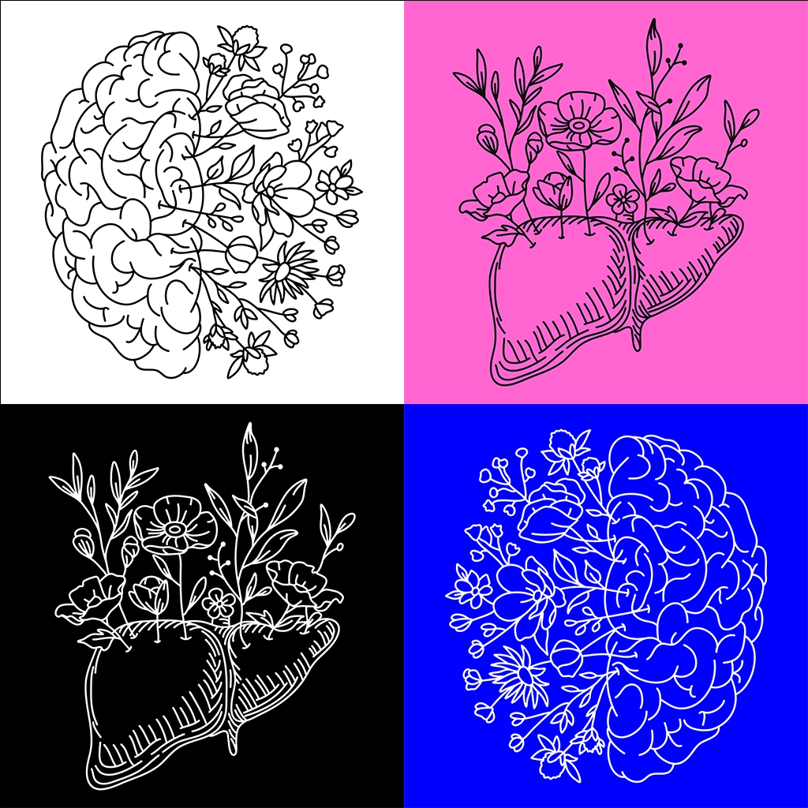
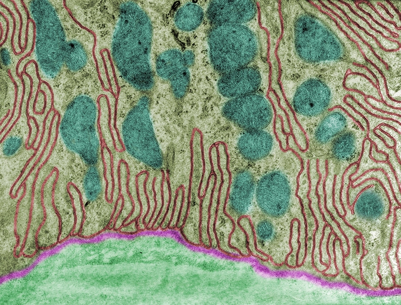

+++
date = "{{ .Date }}"
+++

With the acquisition of complexity, organisms have evolved numerous strategies facilitating tight communication across organs. The seamless regulation of metabolism occurs within our bodies. Without our conscious awareness, multiple organs interact cohesively, supplying essential substances to sustain life activities. We want to decode the harmonious designs that regulate the metabolism at the physiological level. Our research focus is on shedding light on the interaction between brains and organs that are essential for metabolic control. 

The liver serves as a primary hub for the innumerable physiological processes essential to regulating metabolic responses. Notably, hepatic glucose production accounts for 80-90% of plasma glucose. While glucose is the primary energy source for the brain, neither gluconeogenesis nor glycogen storage significantly contributes to glucose supply in this organ. Thus, brain function heavily relies on the liver's metabolism, and vice versa, as the metabolic function of the liver is regulated by top-down signaling derived from the central nervous system. However, countless knowledge gaps remain in understanding the bidirectional dynamic communication between these two critical organs. Questions such as how peripheral efferent neurons are controlled by top-down signals, how the central nervous system achieves precise control of the hepatic metabolic response, and whether any bottom-up signals, aside from glucose, produced by the liver influence cognitive function, remain to be elucidated.

Mitochondria, critical organelles controlling intracellular metabolism, exhibit a high degree of interactivity and engagement. This could be a heritage of their endosymbiotic ancestors. They dynamically fuse and divide, facilitating the exchange of contents, including proteins, nucleotides, and metabolites. Forming physical contact sites with organelles like the endoplasmic reticulum and lysosomes, mitochondria enable tight inter-organelle communication. Remarkably, mitochondria can be transferred between cells, even crossing tissue boundaries. We will uncover the nature of mitochondria in the context of inter-organ interaction, particularly understanding how mitochondria in multiple organs respond to achieve specific metabolic states at the systemic level.
