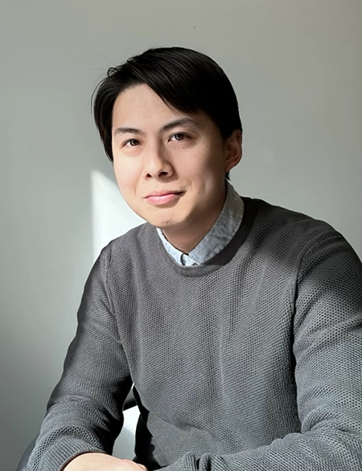

Tatsuya Yamada, Ph.D.​  
Principal Investigator  
Assistant Professor​ 
Department of Biochemistry​ 
N241 Beadle, University of Nebraska-Lincoln​ 
Lincoln, NE​ 
TEL: 402-472-6504​ 
Email: tyamada2”@”unl.edu​ 
CV link
​

|       |  |      |
| :--:        |    :--:   |          :--: |
|       |       |    |

We are actively searching for motivated scientists at all levels​!

Positions of postdoctoral researchers, graduate students, undergraduate students, research assistants, and technicians are open to individuals who have enthusiasm for physiological research.
